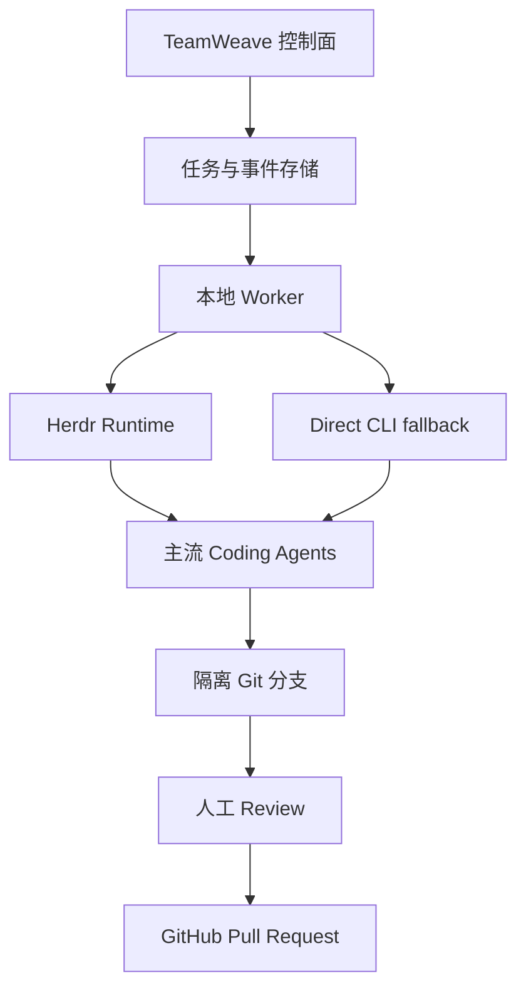

# TeamWeave

TeamWeave 是一个面向真实 Coding Agent 的本地优先控制面。它把主流 Coding Agent CLI 变成可观察、可恢复、可审批的执行单元，同时支持单 Agent 任务和多 Agent 顺序协作。

它不是聊天界面，也不把多个模型简单放进同一个群聊。控制面保存任务、Session、handoff、执行事件与人工决策；本地 Worker 负责调用真实 Agent、管理 Git 分支，并在批准后创建 Pull Request。

> 当前状态：V0.2 / TW-26 Workspace Shell UI 已完成第一版，并已升级为面向商用产品的控制台壳层。除原有 Agent 控制面外，支持持久化 Development Workspace、本地 Worker 生命周期、隔离分支、可恢复的 clone/reuse、浏览器 Terminal，以及把 Collaboration、Files、Git、Preview、Terminal、Agent Runs 收进同一工作区界面。控制台提供 Overview、Repositories、Workspaces、Workers、Activity 持久导航、Worker fleet 健康状态和按当前状态给出的 Next action。

## 核心能力

| 能力 | 当前实现 |
| --- | --- |
| 单 Agent | Pi、Codex、Claude Code、Gemini、Cursor、Copilot、OpenCode、Qwen、Aider 等任一 Agent 独立执行 |
| 多 Agent | 2–4 个 Session 按自定义角色和顺序协作 |
| Agent Runtime | 优先使用 Herdr，未安装时可降级到直接 CLI |
| 跨 Session 通信 | 持久化 handoff，包含摘要、产物路径、Git ref 和投递状态 |
| 人工介入 | Agent 阻塞时在控制台回复，并恢复原 Herdr Session |
| Git 隔离 | 每个任务使用独立分支，多 Session 顺序修改同一分支 |
| Development Workspace | 从 GitHub 仓库创建可复用的本地 checkout；Worker 负责 clone/reuse、分支初始化、READY/FAILED 状态和断线恢复 |
| Browser Terminal | 在 READY 工作区中打开本地 Shell；浏览器输入通过控制面排队到 Worker，输出持久化后实时回传 |
| Workspace Shell UI | 从仓库或 Workspace 卡片进入统一开发界面；在同一屏切换项目、发起任务、查看 Session、进入审核，并操作 Files/Git/Preview/Terminal/Agent Runs |
| GitHub 交付 | 分支先供人工检查，批准后才创建 PR；不会自动合并 |
| 故障恢复 | Worker 心跳、任务重领、Herdr Session 标识和幂等消息 |

## 工作方式



多 Agent 任务中，上一个 Session 的输出不会依赖终端滚屏隐式传递，而是转成结构化消息：

```json
{
  "fromSessionId": "sess_planner",
  "toSessionId": "sess_implementer",
  "kind": "handoff",
  "body": "认证方案已确定，下一步实现 callback 与测试。",
  "artifacts": ["docs/auth-design.md"],
  "gitRef": "a81f3c2",
  "status": "pending"
}
```

消息状态按 `pending → delivered → acknowledged` 推进，因此即使 Worker 或 Agent 重启，也能判断交接是否完成。

## 快速了解

### 控制面

控制面是 Vinext/React 应用，运行在 Cloudflare Workers 兼容环境中：

- D1 保存仓库、Worker、任务、Agent Session、消息和事件。
- 浏览器写操作要求 ChatGPT 身份。
- Worker API 使用独立 Bearer Token。
- GitHub 凭据和 Agent 登录信息始终留在本地 Worker。

### 支持的 Agent actors

Worker 通过可扩展 Actor Registry 探测本机 CLI。核心与常见 Agent 支持 Direct CLI；Herdr 可把更多终端 Agent 纳入持久 Session：

| Actor | Direct CLI | Herdr Session |
| --- | :---: | :---: |
| Pi、Codex、Claude Code | ✓ | ✓ |
| Gemini CLI、Cursor Agent、GitHub Copilot、OpenCode、Qwen Code | ✓ | ✓ |
| Aider | ✓ | — |
| Kimi Code、Kiro CLI、Factory Droid、Amp、Devin CLI、Cline、Qoder CLI | — | ✓ |

`auto` 会按每个 Session 选择可用 Runtime，因此一个顺序 Workflow 可以同时包含 Herdr Agent 和 Direct-only Agent。显式选择 `direct` 或 `herdr` 时，控制面会在排队前校验兼容性。

### 本地 Worker

准备以下工具：

- Node.js 22.13+
- Git 与 [GitHub CLI](https://cli.github.com/)
- 上表中至少一个 Agent CLI
- 推荐安装 [Herdr](https://herdr.dev/docs/install/)

先完成本机认证：

```bash
gh auth login
gh auth setup-git
herdr
```

随后在 TeamWeave 的 **Workers** 页面注册本机，复制页面生成的一次性启动命令。Worker 会自动探测已安装的 Agent 与 Herdr；也可以用 `AGENTMUX_ACTORS=codex,gemini` 限制本次 Worker 暴露的 actor 集合。

在 **Repositories** 页面点击 **Open workspace**，控制面会创建一个持久化 Development Workspace。Worker 领取后会在本机 `AGENTMUX_WORKDIR` 下为仓库 clone 或复用 checkout，创建 `teamweave/workspace-...` 工作分支，并把本地路径、分支和状态回报到 **Workspaces** 页面。工作区停止后可以重新排队；`claiming` / `preparing` 状态在 Worker 断线后会被原 Worker 恢复。

工作区创建后，点击 **Open workspace** 进入 Workspace Shell。左侧切换项目，中间的 **Collaboration** 区域发起 Agent 任务并进入回复、重试或批准流程，右侧在 **Files / Git / Preview / Terminal / Agent Runs** 之间切换。工作区进入 `ready` 后可在 **Terminal** 中打开该 checkout 的交互 Shell。浏览器命令经过控制面写入持久化命令队列，由绑定的 Local Worker 执行；Shell 输出和状态事件写入 D1，终端面板每秒增量读取，因此离开面板后重新进入仍能看到同一终端会话。Worker 会清理 TeamWeave Token 和常见 GitHub Token，不把它们注入 Shell。

### 开发验证

```bash
npm run install:ci
npm test
```

`npm test` 会完成生产构建，并验证控制台、Herdr 运行时、跨 Session 协议和基础 UI 组件。

## 安全边界

- Agent 不接收 TeamWeave Worker Token。
- 直接 CLI 模式会移除传入 Agent 进程的 GitHub Token 环境变量。
- 每个任务使用独立工作分支。
- Development Workspace 使用独立工作分支；关联任务会复用已准备好的 checkout。
- Agent 无权自动创建 PR、合并或修改 Git remote。
- PR 只在控制台明确批准后创建。
- 控制面只保存仓库地址，不保存本地 GitHub 登录凭据。

Herdr 由本机用户启动，Agent 会继承 Herdr Server 的本地环境。生产使用时，应从不含多余敏感环境变量的终端启动 Herdr。

## 文档

- [系统架构](docs/ARCHITECTURE.md)
- [部署与 Worker 配置](docs/DEPLOYMENT.md)
- [控制面 API](docs/API.md)

## 当前限制

- 多 Agent 当前采用顺序执行，尚未开放同一分支上的并发编辑。
- Workflow 是显式 Session Pipeline，不包含自动规划任意 DAG。
- 私有 Sites 入口可能在请求到达 Worker API 前拦截本地进程；真实远程 Worker 需要公开入口加应用层认证，或等价的可信网络通道。
- 自动合并、组织级权限、预算策略和跨仓库事务尚未实现。
- 进程/端口发现和内嵌 Preview 将在 TW-24 至 TW-25 实现。

## 项目结构

```text
app/                         控制台与 API Routes
db/                          D1 / Drizzle 数据模型
drizzle/                     数据库迁移
lib/control-plane.ts         鉴权、ID 与数据库辅助函数
public/agentmux-worker.mjs   本地 Agent Worker
tests/                       构建和协议测试
worker/                      Cloudflare Worker 入口
docs/                        架构、部署与 API 文档
```

## 设计原则

1. **控制面负责语义，Runtime 负责进程。** Herdr 管理真实终端和 Agent 生命周期；TeamWeave 管理任务、消息、权限和因果关系。
2. **跨 Session 通信必须可持久化。** 不依赖共享聊天历史或终端滚屏。
3. **默认不自动交付。** Agent 可以写代码，Worker 可以推送隔离分支，但 PR 创建需要人工批准。
4. **单 Agent 与多 Agent 共用同一抽象。** 单 Agent 只是只有一个 Session 的 Pipeline。
