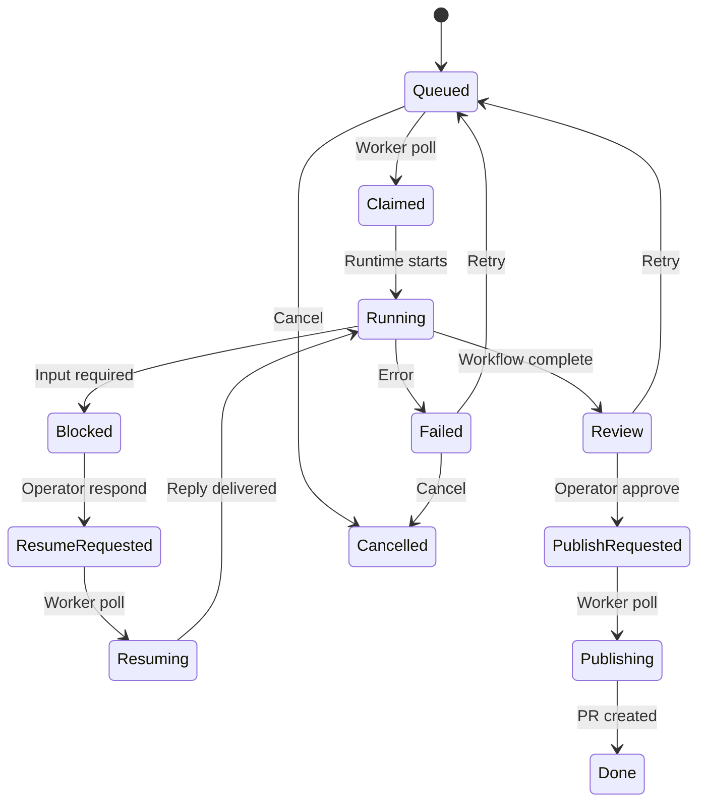

# 控制面 API

本文记录当前 MVP 的 HTTP 接口。接口尚未版本化，主要供 TeamWeave Web Console 和官方 Local Worker 使用。

## 鉴权

### 浏览器接口

`/api/state`、`/api/repositories`、`/api/tasks` 和 `/api/workers/enroll` 使用部署平台注入的 `oai-authenticated-user-id` 确定 owner；如果当前 Sites 入口只转发已验证的 `oai-authenticated-user-email`，控制面会使用带 `email:` 前缀的邮箱作为稳定回退标识。

调用方不应自行伪造该 Header；生产入口必须在请求到达应用前完成可信身份校验。

### Worker 接口

`/api/worker/poll` 与 `/api/worker/events` 使用注册 Worker 时得到的 Bearer Token：

```http
Authorization: Bearer amx_REDACTED
Content-Type: application/json
```

服务端只保存 Token 的 SHA-256 Hash。Token 遗失时应重新注册 Worker。

## 浏览器接口

### GET /api/state

返回当前 owner 的控制面快照。

```json
{
  "repositories": [],
  "workers": [],
  "tasks": [],
  "events": [],
  "sessions": [],
  "messages": [],
  "workspaces": [],
  "workspaceEvents": [],
  "processes": [],
  "ports": [],
  "serverTime": 1788316800000
}
```

返回上限：

- 最近更新的 100 个 Task；
- 最近 300 个 Task Event；
- 最多 500 条 Session Message。

`capabilities`、`runtimes`、`payload` 和 `artifacts` 已解析为 JSON 值。

`processes` 和 `ports` 是当前 owner 工作区的最近运行时快照；控制台只展示 `running` / `listening` 记录。命令行已在 Worker 端做长度限制和常见凭据脱敏，端口 URL 只允许生成 `http(s)://localhost:<port>`，供连接 Worker 的同一台机器以内嵌 Preview 加载。

### POST /api/repositories

连接一个 GitHub 仓库。控制面保存地址，不保存 GitHub 凭据。

```json
{
  "fullName": "owner/repository",
  "defaultBranch": "main",
  "visibility": "private"
}
```

`fullName` 也可传完整 GitHub URL；服务端会规范化为 `owner/repository`。公开仓库会尝试从 GitHub 公共 API补全默认分支和可见性。

成功返回 `201`：

```json
{
  "repository": {
    "id": "repo_...",
    "fullName": "owner/repository",
    "url": "https://github.com/owner/repository.git",
    "defaultBranch": "main",
    "visibility": "private",
    "createdAt": 1788316800000
  }
}
```

### DELETE /api/repositories?id=repo_...

删除连接记录。仓库仍有未结束任务时返回 `409`，不会修改 GitHub 上的仓库。

### POST /api/tasks

创建 Task 和对应 Agent Session。

单 Agent：

```json
{
  "repositoryId": "repo_...",
  "workspaceId": "ws_...",
  "title": "修复登录回调",
  "prompt": "定位失败原因、实现修复并运行测试。",
  "mode": "single",
  "runtime": "auto",
  "actor": "codex",
  "model": "",
  "baseBranch": "main"
}
```

`workspaceId` 可选。传入后，Task 会等待该 Development Workspace 达到 `ready`，再在其本地 checkout 和 working branch 上执行；不传则保持任务级临时 checkout 行为。

多 Agent：

```json
{
  "repositoryId": "repo_...",
  "title": "实现 GitHub OAuth",
  "prompt": "给控制台增加安全的 GitHub OAuth 流程。",
  "mode": "multi",
  "runtime": "herdr",
  "baseBranch": "main",
  "steps": [
    {
      "actor": "claude",
      "role": "分析现有认证边界",
      "model": ""
    },
    {
      "actor": "codex",
      "role": "实现并测试",
      "model": ""
    }
  ]
}
```

约束：

- `actor` 必须来自 Actor Registry：`pi`、`codex`、`claude`、`gemini`、`cursor`、`copilot`、`opencode`、`qwen`、`aider`、`kimi`、`kiro`、`droid`、`amp`、`devin`、`cline` 或 `qodercli`；
- `runtime` 为 `auto`、`herdr` 或 `direct`；
- 显式 `runtime` 会校验所有 Step 的兼容性；例如 Aider 只能使用 `direct`，Kimi Code 只能使用 `herdr`；
- 多 Agent 必须包含 2–4 个 Step；
- `title` 最大 200 字符，`prompt` 最大 12000 字符；
- 仓库必须属于当前 owner。

成功返回 `201`，包含新 Task 及其 `sessions`。

### POST /api/tasks/:id/action

控制任务决策。Body 的 `action` 支持：

| Action | 允许的 Task 状态 | 结果 |
| --- | --- | --- |
| `approve` | `review` | 转为 `publish_requested`，等待 Worker 创建 PR |
| `retry` | `review`、`failed` | attempt 加一，清空执行结果并重新排队 |
| `cancel` | `queued`、`failed` | 转为 `cancelled` |
| `respond` | `blocked` | 保存人工回复并转为 `resume_requested` |

批准或重试：

```json
{
  "action": "approve"
}
```

回复阻塞 Session：

```json
{
  "action": "respond",
  "reply": "可以修改迁移，但保持向后兼容。"
}
```

Action 与当前状态不匹配时返回 `409`。

### POST /api/workers/enroll

注册本地 Worker。

```json
{
  "name": "Build Mac"
}
```

成功返回 `201`：

```json
{
  "worker": {
    "id": "worker_...",
    "name": "Build Mac",
    "createdAt": 1788316800000
  },
  "token": "amx_..."
}
```

`token` 是唯一一次返回的原始凭据。

### POST /api/worker/processes

Worker 每隔几秒上报 READY 工作区的本地进程和 TCP 监听端口。此接口只接受绑定 Worker 自己的工作区，并要求进程 `cwd` 位于该工作区 checkout 内；控制面会将上一轮未出现的记录标为 `stale`，再按工作区/PID 和工作区/协议/端口幂等更新。

```json
{
  "snapshots": [
    {
      "workspaceId": "ws_...",
      "processes": [
        { "pid": 4812, "parentPid": 4700, "name": "node", "command": "next dev", "cwd": "/Users/me/.agentmux/workspaces/ws_..." }
      ],
      "ports": [
        { "pid": 4812, "host": "127.0.0.1", "port": 3000, "protocol": "http", "label": "Next.js development server" }
      ]
    }
  ]
}
```

成功返回当前 Worker 仍处于 READY 的工作区列表和 `reportedAt`。Worker 不上传源码、请求内容或 Git 凭据。

### GET /api/workspaces

返回当前 owner 的仓库级 Development Workspace，字段包括 `repositoryId`、`workerId`、`localPath`、`baseBranch`、`workingBranch`、`status`、`error`、`lastActiveAt` 和时间戳。

### POST /api/workspaces

创建或复用一个仓库工作区：

```json
{
  "repositoryId": "repo_...",
  "baseBranch": "main"
}
```

新工作区状态为 `queued`，Worker 领取后依次回报 `claiming`、`preparing`、`ready`；如果 clone、fetch 或分支初始化失败则为 `failed`。同一仓库已有活动工作区时返回该工作区，不重复创建。

### POST /api/workspaces/:id/action

支持 `stop`（停止排队或就绪工作区）、`reopen`（将 `stopped` / `failed` 工作区重新排队）和 `delete`（仅删除没有关联 Task 的 `stopped` / `failed` 工作区）。

### GET /api/workspaces/:id/terminal

读取工作区最近一个终端会话及增量事件。传入 `terminalId` 可指定会话，传入 `after` 只返回事件 ID 大于该值的记录。

```json
{
  "terminal": {
    "id": "term_...",
    "workspaceId": "ws_...",
    "shell": "bash",
    "cwd": "/Users/me/.agentmux/workspaces/ws_...",
    "status": "running",
    "pid": 4812,
    "cols": 120,
    "rows": 32
  },
  "events": [
    {
      "id": 18,
      "kind": "terminal.output",
      "data": "git status\\n",
      "payload": { "stream": "stdout" },
      "createdAt": 1788316800000
    }
  ],
  "nextAfter": 18
}
```

### POST /api/workspaces/:id/terminal

在 READY 工作区创建或控制终端。所有动作都会先写入 D1 命令队列，再由绑定 Workspace 的 Worker 领取。

启动（重复启动会复用当前活动会话）：

```json
{ "action": "start", "shell": "bash", "cols": 120, "rows": 32 }
```

发送输入、调整尺寸或停止：

```json
{ "action": "input", "terminalId": "term_...", "data": "npm install\\n" }
{ "action": "resize", "terminalId": "term_...", "cols": 140, "rows": 40 }
{ "action": "stop", "terminalId": "term_..." }
```

支持的 Shell 名称为 `bash`、`zsh`、`sh`，Windows Worker 另支持 `powershell`、`pwsh` 和 `cmd`。Workspace 未达到 `ready` 时返回 `409`。

## Worker 接口

### POST /api/worker/poll

上报当前执行机能力，并原子领取一个可执行作业。

```json
{
  "platform": "dev-mac · darwin arm64",
  "capabilities": ["codex", "claude", "gemini", "aider"],
  "runtimes": ["herdr", "direct"]
}
```

有作业时返回：

```json
{
  "job": {
    "id": "task_...",
    "operation": "run",
    "executionMode": "multi",
    "runtime": "auto",
    "repository": "owner/repository",
    "repositoryUrl": "https://github.com/owner/repository.git",
    "baseBranch": "main",
    "workBranch": null,
    "sessions": [],
    "messages": []
  }
}
```

`operation` 为：

- `run`：开始或恢复任务执行；
- `resume`：向原活动 Session 投递人工回复并继续；
- `publish`：推送分支并创建 PR。
- `workspace`：准备或恢复一个 Development Workspace；返回值包含 `workspace` 元数据，不包含 Agent Session。
- `terminal`：执行一个 Workspace Terminal 命令；返回 `terminal`、`workspace` 和待执行的 `command`。

没有匹配作业时返回：

```json
{
  "job": null,
  "pollAfterMs": 3500
}
```

领取条件会检查所有 Session 的 Agent 是否在 `capabilities` 中，以及指定 Runtime 是否被 Worker 支持。`auto` 会逐 Session 检查 Actor Registry 的 Runtime 矩阵，因此允许 Herdr 与 Direct-only actor 混合。任务通过带旧状态条件的单条更新完成领取，避免两个 Worker 同时获得同一作业。

### POST /api/worker/events

上报任务事件，并可在同一请求中更新 Task、Session 或 Session Message。

```json
{
  "taskId": "task_...",
  "kind": "agent.completed",
  "message": "Implementation session completed",
  "status": "running",
  "activeSessionId": "sess_...",
  "summary": "Implemented callback and tests.",
  "diffStat": "3 files changed",
  "workBranch": "teamweave/123456789abc",
  "payload": {
    "runtime": "herdr"
  },
  "session": {
    "id": "sess_...",
    "status": "done",
    "runtime": "herdr",
    "runtimeName": "codex",
    "workspaceId": "workspace_...",
    "paneId": "pane_...",
    "summary": "Implementation completed."
  },
  "sessionMessage": {
    "id": "msg_...",
    "fromSessionId": "sess_...",
    "toSessionId": "sess_...",
    "kind": "handoff",
    "body": "Callback is implemented; verify edge cases.",
    "artifacts": ["app/api/oauth/callback/route.ts"],
    "gitRef": "a81f3c2",
    "status": "acknowledged"
  }
}
```

每个请求只允许更新 Token 对应 Worker 已领取的 Task。Session ID 和消息两端 ID 都会验证必须属于该 Task。

Worker 也可以用同一接口上报 Workspace 生命周期：将 `workspaceId` 和 `workspace`（`id`、`status`、`localPath`、`workingBranch`、`error`）放入请求。此类事件写入 `workspace_events`，并只允许更新当前 Worker 领取的 Workspace。

允许的 Task 状态更新：

- `running`
- `blocked`
- `review`
- `done`
- `failed`

允许的 Session 状态：

- `pending`
- `starting`
- `working`
- `blocked`
- `done`
- `failed`

`worker.heartbeat` 只刷新时间，不写 Task Event。其他 `kind` 会追加到事件时间线。

### POST /api/worker/terminal

Worker 用该接口回传终端状态、Shell 输出和命令完成结果。请求必须带 Worker Bearer Token，并且 `terminalId` 必须属于当前 Worker 领取的 Workspace。

```json
{
  "terminalId": "term_...",
  "commandId": "termcmd_...",
  "kind": "terminal.output",
  "data": "npm install\\n",
  "payload": { "stream": "stdout" },
  "terminal": {
    "status": "running",
    "pid": 4812,
    "cwd": "/Users/me/.agentmux/workspaces/ws_..."
  }
}
```

输出事件不会修改命令状态；`terminal.command_done` / `terminal.command_failed` 会分别把队列命令标为完成或失败。终端状态支持 `queued`、`starting`、`running`、`stopping`、`exited`、`stopped` 和 `failed`。

## 状态机



## 典型事件类型

| Event kind | 含义 |
| --- | --- |
| `task.created` | 用户创建任务与 Session 计划 |
| `worker.claimed` | Worker 原子领取作业 |
| `worker.recovered` | Worker 恢复超过窗口的中断作业 |
| `agent.started` | 某个 Agent Session 已启动 |
| `agent.completed` | 某个 Agent Session 已完成 |
| `agent.blocked` | Agent 等待人工输入 |
| `operator.replied` | 控制台已持久化人工回复 |
| `workflow.completed` | 所有 Session 完成，进入 Review |
| `decision.approved` | 用户批准创建 PR |
| `github.pr_created` | PR 创建成功 |
| `worker.failed` | Worker 无法完成当前作业 |
| `terminal.output` | Shell stdout/stderr 增量输出 |
| `terminal.input` | Worker 已写入 Shell 的输入 |
| `terminal.started` | Shell 已在 Workspace checkout 启动 |
| `terminal.exited` | Shell 自然退出 |
| `terminal.stopped` | 用户请求停止 Shell |
| `terminal.command_failed` | 终端命令无法执行 |

客户端应把 `kind` 当作可扩展字符串，并以 Task `status` 作为主要状态来源。

## 错误约定

错误响应统一包含：

```json
{
  "error": "Human-readable message"
}
```

常见状态码：

| 状态码 | 含义 |
| --- | --- |
| `400` | Body 或关联 Session/Message 无效 |
| `401` | 缺少浏览器身份或 Worker Token 无效 |
| `404` | owner/worker 看不到目标资源 |
| `409` | 重复资源或 Action 与当前状态冲突 |
| `502` | 外部 GitHub 元数据验证失败 |
