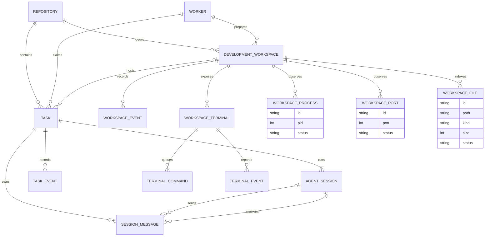
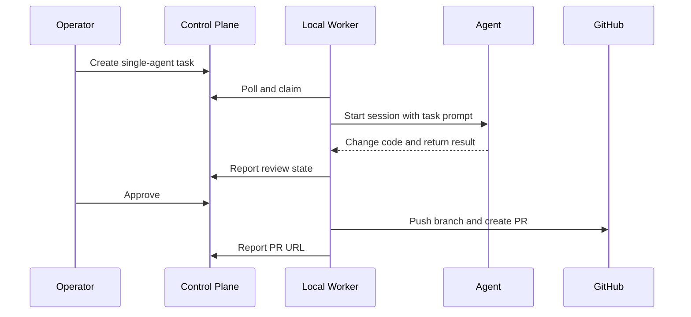
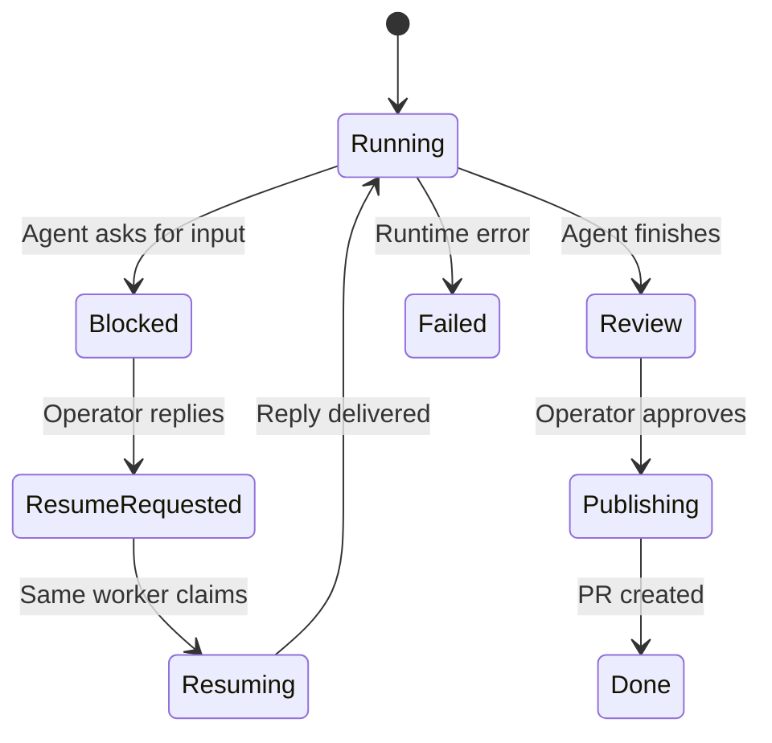

# TeamWeave 架构

本文描述 TeamWeave **V0.2.0** 的运行边界、Development Workspace 生命周期、单 Agent、多 Agent 和跨 Session 通信的实现。

## 系统边界

| 组件 | 职责 | 明确不负责 |
| --- | --- | --- |
| Web Console | 创建任务、查看进度、回复阻塞问题、批准发布 | 不直接运行 Agent，不保存 GitHub 凭据 |
| Control Plane API | 鉴权、调度、持久化任务/Session/消息/事件 | 不访问本地工作区 |
| D1 | 保存控制面状态与可恢复的通信记录 | 不保存代码仓库和 Agent 登录态 |
| Local Worker | 领取任务、准备 Git 分支、驱动 Runtime、托管 Workspace Shell、上报状态 | 不替控制面做用户授权决策 |
| Herdr Runtime | 管理持久终端、Pane 和 Agent 进程 | 不定义任务语义和权限策略 |
| Agent CLI | 通过 Actor Registry 接入主流 Coding Agent，执行真实代码工作 | 不持有 TeamWeave Worker Token |
| GitHub | 保存分支和 Pull Request | 不承担 Session 间消息传递 |

## 核心数据模型

`WORKSPACE_PROCESS` 保存 Worker 在 checkout 内观察到的进程元数据；`WORKSPACE_PORT` 保存与进程关联的本地 TCP 监听端口。两者都是可过期的观测记录，不是控制面启动或管理进程的句柄。

### Development Workspace

Development Workspace 是仓库级、可复用的本地开发 checkout。它保存 `repositoryId`、可选的 `workerId`、本地路径、`baseBranch`、`workingBranch`、生命周期状态和最近活跃时间。状态按 `queued → claiming → preparing → ready` 推进，也可以进入 `failed` 或由用户 `stopped`；`claiming` / `preparing` 超过恢复窗口后，原 Worker 可以重新领取。

创建 Workspace 只在控制面写入元数据，不上传源码或 Git 凭据。Worker 领取后负责 clone/reuse 仓库、fetch、从基础分支创建隔离工作分支，并通过 `/api/worker/events` 回报本地路径和状态。关联 Task 会等待 Workspace `ready` 后再被 Worker 领取，从而让后续 Terminal、Agent 和 Preview 共用同一 checkout。

### Workspace Terminal

Terminal 是 Development Workspace 下的第二类可执行作业，与 Agent Session 共用同一个本地 checkout，但不把 Shell 进程放进 Cloudflare 控制面。浏览器只提交 `start`、`input`、`resize`、`stop` 命令；控制面把命令写入 `workspace_terminal_commands`，绑定该 Workspace 的 Worker 通过轮询原子领取。

Worker 在本机启动交互 Shell，维护 `terminalId → child process` 映射，并把 stdout/stderr 分块回传到 `workspace_terminal_events`。浏览器用 `after` 游标每 900ms 增量读取事件，所以输出具有实时体验，同时保留了跨窗口重连所需的历史。Worker 重启后，下一条输入会按同一个工作区路径重新建立 Shell；命令租约超过一分钟会回到队列。

终端运行在 Worker 的 `AGENTMUX_WORKDIR` 子目录中，Shell 环境会移除 TeamWeave Worker Token 和常见 GitHub Token。Workspace `localPath` 只作为 Worker 已经创建的本地路径提示，服务端不会读取或上传该目录内容。

### Workspace Shell UI

Workspace Shell 是 Development Workspace 的统一产品表面，不创建第二套 Task、Agent Session 或事件模型。左侧只负责在现有 Workspace 间导航；中间 Collaboration 面板按 `workspaceId` 聚合 Task、Session 和需要人工处理的状态；右侧 Files、Git、Preview、Terminal、Agent Runs 共享同一 Workspace 上下文。

Terminal 直接复用现有持久化 Terminal API，Agent Runs 直接读取 `agent_sessions`，Git 与人工审核仍进入原有 Task Detail/PR gate。Worker 每 5 秒扫描 READY checkout 的本地进程和 TCP 监听端口，并约每 15 秒扫描一次目录元数据，将快照写入 `workspace_processes` / `workspace_ports` / `workspace_files`；控制台 Files 面板只展示经过路径过滤的相对路径、文件夹、大小和更新时间，不读取文件内容。Preview 面板展示真实检测结果，并在有监听端口时以内嵌 iframe 加载经过校验的 `http(s)://localhost:<port>`。该入口只对连接 Worker 所在的同一台机器有效；文件内容编辑、公网隧道、分享链接和自动部署仍未开放，界面不会把 Worker 的 checkout 或 localhost 暴露到公网。

### Workspace Files

`workspace_files` 是 Worker 定期上报的只读目录索引，不是远程文件系统。Worker 只遍历工作区 checkout 的有限深度和数量，跳过 `.git`、`node_modules`、构建产物、缓存目录、虚拟环境以及常见 `.env` / 证书密钥文件；符号链接不会被跟随。控制面再次校验相对路径、文件类型和大小，并按工作区路径幂等更新，上一轮未出现的记录标记为 `stale`。因此 Files 面板适合快速定位项目结构，实际查看或修改内容仍通过本地 Terminal、Agent Run 或 GitHub 完成。

### Workspace process and port discovery

Worker 只为自己绑定的 READY Workspace 上报快照。进程的工作目录必须位于该 Workspace checkout 内；命令行经过长度限制和常见 token/secret/password/api-key 脱敏后才会离开本机。控制面按 owner、worker 和 workspace 校验数据，先把上一轮 `running` / `listening` 记录标记为 `stale`，再幂等写入当前快照。端口只保存本地预览所需的协议、监听地址、端口、关联 PID 和显示标签，不读取或上传应用内容。

### Task

一次面向仓库的工作单元。Task 保存执行模式、Runtime 偏好、基础分支、工作分支、当前活动 Session、汇总结果与 PR 地址。

### Agent Session

一个明确的 Agent 执行阶段，包含：

- `actor`：Actor Registry 中的 Agent 标识，例如 `pi`、`codex`、`claude`、`gemini`、`cursor`、`copilot`、`opencode`、`qwen` 或 `aider`；
- `role`：该阶段的职责；
- `ordinal`：顺序执行位置；
- `runtime`、`workspaceId`、`paneId`：恢复真实 Herdr Session 所需的定位信息；
- `status` 和 `summary`：阶段状态与交付摘要。

单 Agent 任务同样创建一个 Agent Session，因此单 Agent 与多 Agent 共用一套调度和恢复逻辑。

### Session Message

跨 Session 通信不是共享一段不可追踪的聊天历史，而是一条持久化消息。消息可以记录发送方、接收方、类型、正文、产物路径、Git ref，以及 `pending`、`delivered`、`acknowledged` 三阶段状态。

这使通信能够跨进程、跨 Worker 轮询，甚至跨控制台浏览器 Session 延续。只要控制面数据库和对应 Herdr Session 仍然存在，重新连接后即可继续投递或恢复。

## 单 Agent 执行

Worker 会在独立工作分支运行 Agent。Agent 完成后，任务进入 `review`；只有用户批准，Worker 才执行发布阶段。

## 多 Agent 顺序协作

当前 MVP 使用 2–4 个 Session 的顺序 Pipeline：

1. Worker 为整个 Task 准备一个隔离工作分支。
2. 第一个 Session 接收原始任务和角色说明。
3. Worker 收集该 Session 的结果，提交它产生的变更。
4. Worker写入一条结构化 `handoff`，记录摘要、产物和当前 Git ref。
5. 下一 Session 在同一分支上启动，并收到原始目标、自己的角色和已有 handoff。
6. 最后一个 Session 完成后，Worker 汇总 diff，任务进入人工 Review。

顺序执行是刻意的安全选择：多个 Agent 并发修改同一工作树会引入非确定性冲突，而独立 worktree 又需要额外的合并协调。当前协议先保证交接可审计和任务可恢复，再扩展并行 DAG。

### Actor Registry 与 Runtime 选择

控制面使用统一的 Actor Registry 描述 Agent 名称、可用 Runtime 和 UI 元数据。Worker 下载的是独立的 JavaScript 文件，因此也内置一份可执行文件注册表：先用 `--version` 探测本机命令，再把已安装 actor 上报给 `/api/worker/poll`。

- `herdr`：通过 `herdr agent start --kind <actor>` 创建持久 Session；适用于 Herdr 支持的终端 Agent。
- `direct`：调用 Agent 的非交互 CLI 适配器；当前覆盖 Pi、Codex、Claude Code、Gemini CLI、Cursor Agent、GitHub Copilot、OpenCode、Qwen Code 和 Aider。
- `auto`：逐 Session 选择 Runtime。这样 Aider 这类 Direct-only actor 可以和 Herdr actor 出现在同一个顺序 Workflow 中；控制面不会把不兼容任务交给 Worker。

## Herdr 集成

Worker 优先使用 Herdr 管理持久 Agent 进程，使用的能力包括：

- `workspace create`：为任务创建持久工作区；
- `pane split`：为多 Agent 阶段准备隔离 Pane；
- `agent start`：按 `actor` kind 启动对应的 Herdr Agent（包括 Pi、Codex、Claude Code、Gemini、Cursor、Copilot、OpenCode、Qwen，以及 Herdr 支持的其他终端 Agent）；
- `agent prompt`：投递阶段 Prompt 或后续人工回复；
- `agent wait`：等待 Agent 到达完成或阻塞状态；
- `agent read`：读取结构化结果；
- `pane send-text` / `agent send-keys`：在恢复路径向原 Session 继续输入。

控制面保存 `workspaceId`、`paneId` 和 Runtime 名称。Worker 中断后重新轮询，可以识别超过恢复窗口的 `claimed`、`running`、`publishing` 或 `resuming` 任务，并尝试继续原作业。

当 Herdr 不可用且任务 Runtime 为 `auto` 时，Worker 可降级到直接 CLI。显式选择 `herdr` 的任务不会静默降级。

## 人工阻塞与恢复

Agent 需要决策时，Worker 将 Task 设为 `blocked` 并保存 `activeSessionId`。用户回复会形成一条目标明确的 `operator.reply` 消息，并把 Task 设为 `resume_requested`。只有原 Worker 可以领取恢复作业；它向同一个 Herdr Session 投递回复，避免丢失此前的终端状态。

## Git 一致性

| 阶段 | Git 行为 |
| --- | --- |
| 准备 | 拉取仓库并从 `baseBranch` 创建任务分支 |
| 每个 Session 完成 | 检查变更；有变更时创建阶段提交 |
| Handoff | 记录当前提交 SHA，供下一 Session 对齐 |
| Review | 保留分支和 diff，等待人工决策 |
| Approve | 推送工作分支并用 `gh pr create` 创建 PR |
| Retry | 增加 attempt，重置 Session 控制面状态并重新排队 |

Agent 不能自动创建 PR 或合并。发布操作由 Worker 的独立 `publish` 作业完成，因此 Agent Prompt 注入或误操作不能绕过人工门禁。

## 信任边界

- 浏览器 API 使用 ChatGPT 身份确定 owner。
- Worker 注册时只返回一次原始 Token，服务端仅保存 Hash。
- Worker 只能读取和更新已分配给同一 owner/worker 的任务。
- Session 更新和消息两端都验证必须属于当前 Task。
- Worker Token 不传给 Agent 子进程。
- 直接 CLI 模式会清理常见 GitHub Token 环境变量；Git 操作使用本机既有 `gh` / Git 凭据。
- Herdr Agent 会继承 Herdr Server 的本机环境，因此应从最小权限环境启动 Herdr。

## 后续扩展点

- 基于独立 worktree 和显式合并节点的并行 DAG；
- 消息租约、重试次数与死信队列；
- 组织级 RBAC、预算与 Runtime 策略；
- 仓库 Webhook 和 PR 状态回流；
- 跨仓库任务与可验证的产物清单。
